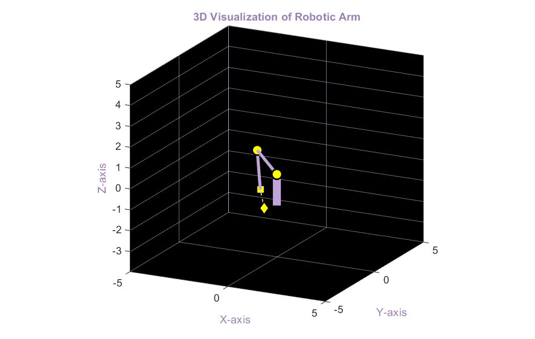
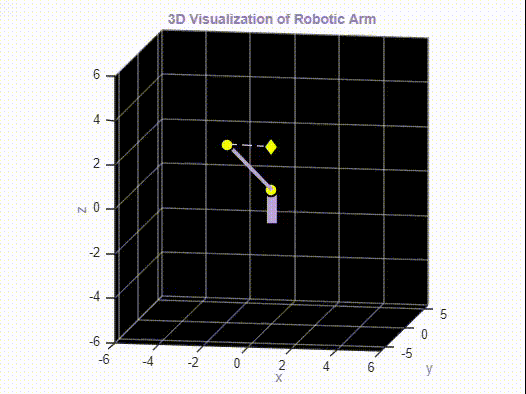
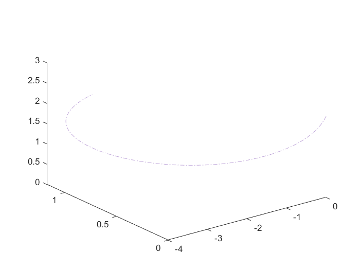
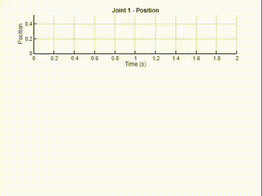
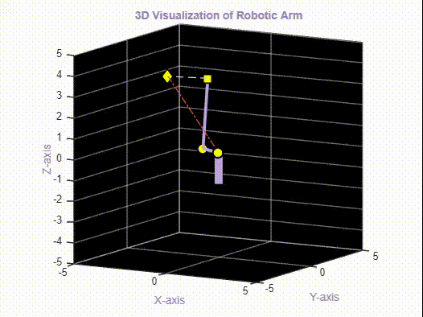

# 3DOF Robotic Arm: Kinematics, Motion and Trajectory Planning

## Project Overview

This MATLAB project simulates the kinematics, motion, and trajectory planning of a 3-degree-of-freedom (3DOF) robotic arm.  The primary goal is to understand and visualize the relationship between joint configurations and the end effector's position in 3D space. Through this simulation, you can explore forward kinematics, inverse kinematics, and different trajectory planning methods to control the arm's movement.

## Key Features

* **End Effector Position Calculation:**  Computes the 3D position of the end effector based on provided joint angles using homogeneous transformation matrices and a geometrical model.
* **Forward Kinematics Analysis:** Analyzes how changing joint angles affects the end effector's position and visualizes the arm's configuration.
* **Trajectory Planning:** Implements and compares two trajectory planning methods:
    * **Cubic Polynomial Trajectory:** Generates smooth trajectories with continuous position, velocity, and acceleration.
    * **Quintic Polynomial Trajectory:** Generates even smoother trajectories with continuous position, velocity, acceleration, and jerk.
* **Inverse Kinematics:** Calculates the required joint angles to reach a specific target position in 3D space.
* **Kinematic Simulation and Animation:** Animates the robotic arm's movement between different joint configurations, visualizing the trajectory of the end effector.
* **Direct Kinematics with Jacobian:** Computes and visualizes the end-effector velocities based on joint velocities and the Jacobian matrix.
* **MATLAB Visualization:** Utilizes MATLAB plotting functions to graphically represent the robotic arm, its movement, and trajectory plots.

## Project Structure

* **`functions/` folder:** This directory houses all the MATLAB functions used in the project. Each `.m` file within this folder typically implements a specific functionality, such as calculating end effector position, plotting the arm, or generating trajectories.  You can find functions like `EndEffectorPosition.m`, `plotKinematics.m`, `trajectoryPlanner.m`, and trajectory generation functions here.

* **`main.mlx`** This is the main MATLAB script for the 3DOF robotic arm simulation. It calls functions from the `functions/` folder to initialize the system, compute the end-effector position, run kinematic simulations, demonstrate trajectory planning, and solve inverse kinematics problems. Additionally, this script includes documentation explaining the implemented methods and results.

* **`Figures&Animations/` folder:** This directory contains images and animations used to visually demonstrate the project features in this README.

## Visual Demonstrations

* **Robotic Arm Configuration**

This image shows a static plot of the 3DOF robotic arm in a specific joint configuration, demonstrating the arm's structure and visualization.

* **Direct Kinematics Animation**

This animation demonstrates the Direct Kinematics of the robotic arm. It visualizes how the end-effector moves as joint angles change over time.

* **Trajectory Planning Comparison**

This animation compares Cubic and Quintic polynomial trajectory planning methods. It visually highlights the smoothness and differences in motion profiles between the two methods.

* **Inverse Kinematics Animation**

This animation demonstrates the Inverse Kinematics functionality. It shows the robotic arm adjusting its joint angles to reach a target end-effector position.

